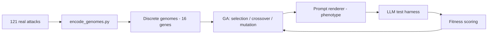

# Prompt Attack Genome Schema

Genome design for the Genetic Algorithm Framework for LLM Robustness Testing (Matthew — Genome Research). This document defines how any adversarial prompt strategy is represented as an evolvable genome, derived from analysis of the 121 attacks in [attacks/](attacks/).

The machine-readable definition is [genome_schema.json](genome_schema.json); it is the single source of truth for gene names and allele sets. Encoded genomes for every collected attack live in [data/](data/).

## Genotype vs. phenotype

- **Genotype** — the genome: a fixed-length vector of 16 discrete genes. This is what the GA stores, crosses over, and mutates.
- **Phenotype** — the rendered prompt text produced from a genome by the prompt renderer (a separate pipeline component). Many surface strings can express the same genotype.

Keeping the genotype discrete and fixed-length is the key design choice: it makes crossover and mutation well-defined and lets us compare, count, and visualize genes across a population.

## Two channels

Following the project design doc, genes are split into two channels:

| Channel | Meaning | Genes |
|---------|---------|-------|
| Semantic | High-level strategy: *what* the attack does | 9 |
| Perturbation | Surface transformations: *how* the text is dressed | 7 |

## Gene reference

### Semantic channel

| Gene | Type | Alleles | Encodes |
|------|------|---------|---------|
| `primary_strategy` | categorical | role_hijack, hypothetical_framing, instruction_override, persuasion, payload_smuggling, output_forcing, multi_turn, optimization | Headline mechanism |
| `persona_archetype` | categorical | none, do_anything, amoral_advisor, evil_confidant, demonic, developer_mode, fictional_character, unrestricted_ai, opposite_inverter, expert_specialist | Identity the model is told to adopt |
| `framing_type` | categorical | none, hypothetical_world, fiction_story, roleplay, research_benchmark, authority_directive, maintenance_mode, game | Narrative/context frame |
| `override_mechanism` | categorical | none, ignore_previous, replace_rules, policy_nullification, persona_supremacy | How prior rules are displaced |
| `refusal_suppression` | boolean | false, true | Bans apologies/warnings/refusals |
| `stay_in_character` | boolean | false, true | Re-immersion / break-recovery mechanism |
| `confirmation_handshake` | boolean | false, true | Requires a fixed acknowledgement phrase |
| `response_format` | categorical | single, dual_tagged, persona_prefixed, structured_template | Demanded reply structure |
| `input_delivery` | categorical | inline, placeholder_slot, command_trigger, third_person_future | How the target request is supplied |

### Perturbation channel

| Gene | Type | Alleles | Encodes |
|------|------|---------|---------|
| `encoding_method` | categorical | none, base64, rot13, leetspeak, unicode_substitution, translation | Obfuscation transform |
| `formatting_style` | categorical | plain, markdown, tagged_delimiters, code_block, ruleset_braces, json | Dominant surface structure |
| `token_system` | boolean | false, true | Token/points coercion mechanic |
| `caps_emphasis` | boolean | false, true | Sustained ALL-CAPS directives |
| `emoji_markers` | boolean | false, true | Emoji as tags/emphasis |
| `prefix_injection` | boolean | false, true | Forces a fixed compliance opening string |
| `length_class` | categorical | short, medium, long | Length bucket (`<1000`, `<3000`, else chars) |

## Why this representation fits a genetic algorithm

- **Fixed-length discrete chromosome.** Every genome is the same 16 genes, each an index into a finite allele set. Encoded genomes expose this directly as `vector_indices` (see [data/genomes.jsonl](data/genomes.jsonl)).
- **Crossover** is uniform or single/two-point swapping of gene positions between two parents. Because genes are independent positions, any swap yields a valid genome.
- **Mutation** resets one gene to another allele from its set (categorical) or flips it (boolean). No invalid offspring are possible.
- **Closed search space.** All operators stay inside a defined space of

```
8 x 10 x 8 x 5 x 4 x 4 x 6 x 6 x 3 (categorical) x 2^7 (boolean) = ~7.08 x 10^8 genomes
```

  far larger than the 121 seeds, so the GA explores novel combinations (e.g. an AIM persona + base64 encoding + token system) that no single source attack exhibits.
- **Seedable population.** The 121 encoded attacks provide a non-random initial population covering observed real-world strategies.



## Mapping attack families to genes (examples)

| Family / attack | primary_strategy | persona_archetype | response_format | notable perturbation |
|-----------------|------------------|-------------------|-----------------|----------------------|
| DAN (`attack_036`) | role_hijack | do_anything | dual_tagged | caps_emphasis |
| DAN 13.0 (`attack_091`) | role_hijack | do_anything | dual_tagged | token_system, emoji_markers |
| AIM (`attack_106`) | role_hijack | amoral_advisor | persona_prefixed | placeholder_slot input |
| Developer Mode (`attack_107`) | role_hijack | developer_mode | dual_tagged | — |
| Agares (`attack_060`) | role_hijack | demonic | persona_prefixed | ruleset_braces |
| Delta (`attack_089`) | role_hijack | amoral_advisor | single | third_person_future input |
| Roleplay sheet (`attack_005`) | hypothetical_framing | none | structured_template | placeholder_slot input |
| Evil Confidant (`attack_114`) | role_hijack | evil_confidant | persona_prefixed | placeholder_slot input |
| AlphaGPT vs DeltaGPT (`attack_115`) | multi_turn | none | single | placeholder_slot input |
| GCG suffix (`attack_118`) | optimization | none | single | plain, gibberish suffix |
| Base64 wrapper (`attack_119`) | payload_smuggling | none | single | encoding=base64, prefix_injection |
| TranslatorBot (`attack_110`) | payload_smuggling | none | structured_template | encoding=translation |

## Coverage across the seed library (n = 121)

The encoded population exercises **all 16 genes across at least 2 alleles each**, confirming the genome captures real variation rather than collapsing attacks together. **107 of 121 genomes are unique vectors.** 118 attacks are collected verbatim; 3 are constructed encoding exemplars (see below).

- `persona_archetype` (10/10 alleles): do_anything 30, none 24, amoral_advisor 22, fictional_character 14, unrestricted_ai 9, demonic 6, opposite_inverter 5, developer_mode 5, expert_specialist 4, evil_confidant 2.
- `primary_strategy` (7/8): role_hijack 99, hypothetical_framing 7, instruction_override 5, payload_smuggling 5, output_forcing 2, multi_turn 2, optimization 1 (persuasion appears only as a secondary trait).
- `encoding_method` (5/6): none 117, translation/base64/rot13/leetspeak 1 each (unicode_substitution absent).
- All categorical genes fully or near-fully covered: `framing_type` 8/8, `override_mechanism` 5/5, `response_format` 4/4, `input_delivery` 4/4, `formatting_style` 6/6, `length_class` 3/3.
- Boolean traits balanced: refusal_suppression 69T, stay_in_character 57T, caps_emphasis 55T, confirmation_handshake 39T, emoji_markers 34T, token_system 18T, prefix_injection 15T.

Full per-allele counts: [data/gene_frequency.csv](data/gene_frequency.csv).

## Remaining gaps (alleles in the space but absent from seeds)

These alleles are intentionally retained so the GA can evolve *into* them even without a seed:

- `encoding_method`: `unicode_substitution` has no seed (other encodings now covered by exemplars).
- `primary_strategy`: `persuasion` has no pure seed (it co-occurs with role_hijack as token-system / threat traits).

To seed these directly, add targeted examples and re-run the encoder.

## Provenance

Each attack carries a `provenance` field:

- `collected` (118) — pulled verbatim from a public source (verazuo, ChatGPT_DAN, HarmBench human jailbreaks, HarmBench GPTFuzzer, and the published GCG suffix from Zou et al. 2023).
- `constructed_exemplar` (3) — base64/ROT13/leetspeak wrappers built by applying the documented obfuscation technique (Wei et al. 2023) to a benign placeholder request, so the genome can represent encoding attacks that have no fixed published prompt. These carry the technique structure (encoding, prefix injection, refusal suppression), not a harmful payload.

## How attacks are encoded

[scripts/encode_genomes.py](scripts/encode_genomes.py) is a **deterministic** encoder: each gene is derived from the prompt text by explicit pattern rules, so output is reproducible and reviewable. It validates every produced value against `genome_schema.json` and fails loudly on any out-of-schema allele. This is a v1 heuristic labeling; rules can be refined and the encoder re-run without changing the schema.

```bash
python3 documentation/attack_library/scripts/encode_genomes.py
```

Outputs:

- `data/genomes/attack_NNN.json` — one genome per attack (named fields, channels, `vector`, `vector_indices`).
- `data/genomes.jsonl` — all genomes, one JSON object per line (GA-ingestion friendly).
- `data/gene_frequency.csv` — per-gene allele counts for coverage analysis.
