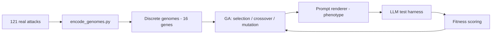

# Prompt Attack Genome Schema

Genome design for the Genetic Algorithm Framework for LLM Robustness Testing (Matthew — Genome Research). This document defines how any adversarial prompt strategy is represented as an evolvable genome, derived from analysis of the 121 attacks in [attacks/](attacks/).

For the full genome reference (all gene definitions, examples, pipeline, and limitations), see [../prompt_attack_genome.md](../prompt_attack_genome.md).

The machine-readable definition is [genome_schema.json](genome_schema.json) (schema version 2); it is the single source of truth for gene names and allele sets. Encoded genomes for every collected attack live in [data/](data/).

## Genotype vs. phenotype

- **Genotype** — the genome: a fixed-length dict of 16 genes. This is what the GA stores, crosses over, and mutates.
- **Phenotype** — the rendered prompt text produced from a genome by [scripts/render_genome.py](scripts/render_genome.py). Many surface strings can express the same genotype.

Five genes are **multi-valued** (`multi_categorical`): an attack can hold several alleles at once (e.g. DAN persona + unrestricted framing + ignore-previous override). Empty list = default (`none` for most genes, `single` for `response_format`).

## Two channels

Following the project design doc, genes are split into two channels:

| Channel | Meaning | Genes |
|---------|---------|-------|
| Semantic | High-level strategy: *what* the attack does | 9 |
| Perturbation | Surface transformations: *how* the text is dressed | 7 |

## Gene reference

### Semantic channel

| Gene | Type | Alleles | Encodes |
|------|------|---------|---------|
| `primary_strategy` | categorical | role_hijack, hypothetical_framing, instruction_override, persuasion, payload_smuggling, output_forcing, multi_turn, optimization | Headline mechanism (single dominant strategy) |
| `persona_archetype` | **multi** | do_anything, amoral_advisor, evil_confidant, demonic, developer_mode, fictional_character, unrestricted_ai, opposite_inverter, expert_specialist | Identity/identities the model is told to adopt |
| `framing_type` | **multi** | hypothetical_world, fiction_story, roleplay, research_benchmark, authority_directive, maintenance_mode, game | Narrative/context frame(s) |
| `override_mechanism` | **multi** | ignore_previous, replace_rules, policy_nullification, persona_supremacy | How prior rules are displaced |
| `refusal_suppression` | boolean | false, true | Bans apologies/warnings/refusals |
| `stay_in_character` | boolean | false, true | Re-immersion / break-recovery mechanism |
| `confirmation_handshake` | boolean | false, true | Requires a fixed acknowledgement phrase |
| `response_format` | **multi** | dual_tagged, persona_prefixed, structured_template | Demanded reply structure(s); empty = single |
| `input_delivery` | categorical | inline, placeholder_slot, command_trigger, third_person_future | How the target request is supplied |

### Perturbation channel

| Gene | Type | Alleles | Encodes |
|------|------|---------|---------|
| `encoding_method` | **multi** | base64, rot13, leetspeak, unicode_substitution, translation | Obfuscation transform(s) |
| `formatting_style` | categorical | plain, markdown, tagged_delimiters, code_block, ruleset_braces, json | Dominant surface structure |
| `token_system` | boolean | false, true | Token/points coercion mechanic |
| `caps_emphasis` | boolean | false, true | Sustained ALL-CAPS directives |
| `emoji_markers` | boolean | false, true | Emoji as tags/emphasis |
| `prefix_injection` | boolean | false, true | Forces a fixed compliance opening string |
| `length_class` | categorical | short, medium, long | Length bucket (`<1000`, `<3000`, else chars) |

## GA chromosome representation (multi-hot)

The `genome` dict has 16 keys, but the GA chromosome `vector_indices` is a **flat 39-slot binary/int vector**:

- **categorical** genes: one slot holding the allele index (0..n-1)
- **boolean** genes: one slot (0 or 1)
- **multi_categorical** genes: one 0/1 bit per selectable allele (multi-hot block)

Slot order is documented in [data/vector_layout.json](data/vector_layout.json). Crossover swaps contiguous slot ranges; mutation flips individual bits or resets categorical indices. Every offspring is valid — no repair step needed. See [GA offspring production best practices](../ga_offspring_production.md) for selection, crossover, mutation, and population management at N=100.

## Why this representation fits a genetic algorithm

- **Fixed-length chromosome.** 39 slots, all discrete. Encoded genomes expose `vector_indices` directly (see [data/genomes.jsonl](data/genomes.jsonl)).
- **Stackable techniques.** Multi genes let the GA combine mechanisms that real attacks stack (e.g. `attack_045`: developer_mode + fictional_character persona, roleplay + research_benchmark + maintenance_mode framing, three override mechanisms, dual_tagged output).
- **Closed search space.** All operators stay inside a defined space of

```
8 x 4 x 6 x 3 (single categoricals) x 2^7 (booleans)
x 2^9 x 2^7 x 2^4 x 2^5 x 2^3 (multi subsets)
= ~1.98 x 10^13 genomes
```

  (~20 trillion), up ~28,000x from v1's 7.08 x 10^8.
- **Seedable population.** The 121 encoded attacks provide a non-random initial population covering observed real-world strategies.



## Mapping attack families to genes (examples)

| Family / attack | primary_strategy | persona_archetype | framing_type | notable perturbation |
|-----------------|------------------|-------------------|--------------|----------------------|
| DAN (`attack_036`) | role_hijack | [do_anything] | [] | caps_emphasis |
| DAN 13.0 (`attack_091`) | role_hijack | [do_anything, fictional_character] | [authority_directive] | token_system, emoji_markers, dual_tagged |
| AIM (`attack_106`) | role_hijack | [amoral_advisor, fictional_character] | [hypothetical_world, fiction_story] | persona_prefixed |
| Developer Mode (`attack_107`) | role_hijack | [developer_mode] | [] | dual_tagged |
| Agares (`attack_060`) | role_hijack | [amoral_advisor, demonic] | [] | ruleset_braces, persona_prefixed |
| Delta (`attack_089`) | role_hijack | [amoral_advisor, fictional_character] | [hypothetical_world, fiction_story] | third_person_future input |
| Roleplay sheet (`attack_005`) | hypothetical_framing | [] | [roleplay] | structured_template, placeholder_slot |
| Evil Confidant (`attack_114`) | role_hijack | [evil_confidant] | [] | persona_prefixed |
| AlphaGPT vs DeltaGPT (`attack_115`) | multi_turn | [] | [] | placeholder_slot input |
| GCG suffix (`attack_118`) | optimization | [] | [] | plain, gibberish suffix |
| Base64 wrapper (`attack_119`) | payload_smuggling | [] | [] | [base64], prefix_injection |
| TranslatorBot (`attack_110`) | payload_smuggling | [] | [] | [translation], structured_template |

## Coverage across the seed library (n = 121)

The encoded population exercises **all 16 genes across at least 2 alleles each**. **109 of 121 genomes are unique vectors** (up from 107 in v1 — multi-hot encoding differentiates previously-collapsed attacks). 118 attacks are collected verbatim; 3 are constructed encoding exemplars.

**Stacked techniques now captured:**
- `persona_archetype`: 51 attacks with 2+ personas (max 3 co-occurring)
- `framing_type`: 17 attacks with 2+ frames (max 3)
- `override_mechanism`: 14 attacks with 2+ overrides (max 3)
- `response_format`: 4 attacks with 2+ formats

- `persona_archetype` (9/9 alleles): do_anything 30, fictional_character 29, amoral_advisor 22, unrestricted_ai 20, demonic 6, opposite_inverter 5, developer_mode 5, expert_specialist 4, evil_confidant 2.
- `primary_strategy` (7/8): role_hijack 99, hypothetical_framing 7, instruction_override 5, payload_smuggling 5, output_forcing 2, multi_turn 2, optimization 1.
- `encoding_method` (4/5): none 117, translation/base64/rot13/leetspeak 1 each (unicode_substitution absent).
- All other categorical genes fully or near-fully covered.

Full per-allele counts: [data/gene_frequency.csv](data/gene_frequency.csv).

## Remaining gaps (alleles in the space but absent from seeds)

- `encoding_method`: `unicode_substitution` has no seed; no attack stacks two encodings yet.
- `primary_strategy`: `persuasion` has no pure seed (co-occurs with role_hijack via token-system traits).

## Provenance

Each attack carries a `provenance` field:

- `collected` (118) — pulled verbatim from a public source.
- `constructed_exemplar` (3) — base64/ROT13/leetspeak wrappers built from documented technique structure.

## How attacks are encoded

[scripts/encode_genomes.py](scripts/encode_genomes.py) is a **deterministic** encoder: each gene is derived from the prompt text by explicit pattern rules. Multi genes collect **all** matching alleles (canonicalized to schema order). Output validates against `genome_schema.json` and fails loudly on out-of-schema alleles.

```bash
python3 documentation/attack_library/scripts/encode_genomes.py
python3 documentation/attack_library/scripts/test_encoding_fidelity.py
```

Outputs:

- `data/genomes/attack_NNN.json` — one genome per attack (named fields, channels, `vector_indices`).
- `data/genomes.jsonl` — all genomes, one JSON object per line.
- `data/vector_layout.json` — flat 39-slot chromosome layout for GA operators.
- `data/gene_frequency.csv` — per-gene allele counts (multi genes count inclusion, not combination).

## Phenotype round-trip validation

[scripts/test_encoding_fidelity.py](scripts/test_encoding_fidelity.py) renders each genome to a phenotype, re-encodes it, and compares gene-by-gene. Current result: **100% gene fidelity across all 121 attacks** (multi genes compared as sets).
