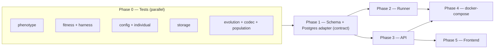

# Build Plan

How we turn the one-shot GA CLI into the controllable, Postgres-backed,
locally-runnable system described in `deployment_architecture.md`.

Guiding constraint: **the GA is expensive to run, so it must run perfectly.**
Every part of `src/ga/` gets tests before any infrastructure is built, and the
LLM-call-guarding logic (response caching, stop conditions, prompt rendering) is
tested first and hardest.

## Phases

| Phase | Deliverable | Depends on |
|-------|-------------|------------|
| 0 | GA core test hardening (~100% coverage of `src/ga/`) | — |
| 1 | Postgres storage adapter + schema/migrations behind a `Storage` port | 0 |
| 2 | Controllable runner: stop/pause/heartbeat + worker mode + config-from-DB | 1 |
| 3 | API / control plane (FastAPI): REST commands + live streaming | 1 |
| 4 | `docker-compose` integration (postgres, migrate, api, runner) | 1, 2, 3 |
| 5 | Frontend dashboard | 3 |

Each phase keeps the existing CLI and file-based path working.

## Dependency graph and parallelization



Two kinds of parallelism:

- **Within Phase 0** — five independent streams, each owning **distinct new
  test files** and touching no source. Fully parallel, zero merge conflicts.
- **After Phase 1** — Phase 1 is the serialization point because it defines the
  schema and storage contract everyone else shares. Once it lands, **Phase 2
  (runner) and Phase 3 (API) run in parallel** because they own disjoint trees
  (`src/ga/` + `scripts/` vs `src/api/`).

### Sub-agent workstream assignments

**Phase 0 (parallel, launch together):**

| Stream | New file(s) | Scope |
|--------|-------------|-------|
| A | `tests/ga/test_phenotype.py` | every frame/persona/format/delimiter renders; target query always present; each noise position; deterministic for a fixed genome |
| B | `tests/ga/test_fitness.py`, `tests/ga/test_harness.py` | all `SyntheticFitnessEvaluator` branches; mock harness branches; `build_harness` routing; `complete()` against a mocked OpenAI client (no network) |
| C | `tests/ga/test_config.py`, `tests/ga/test_individual.py` | `from_dict` drops unknown keys; `for_provider` base_urls; `load_config` json+yaml; CLI overrides; record round-trip; response-hash stability |
| D | `tests/ga/test_storage.py` | dir layout; jsonl record content; lineage append-only; summary.csv math |
| E | `tests/ga/test_evolution_units.py`, `tests/ga/test_codec_extra.py`, `tests/ga/test_population_extra.py` | `evaluate_population` skips already-scored individuals; `evolve_generation` returns exactly `population_size` with elites preserved; `should_stop` all branches; reproducibility (same seed -> identical lineage); encode/decode idempotency; seed-count sums |

Rules for Phase 0 agents: create only the named new files, do not modify
`src/` or existing tests, follow existing conventions (per-file pytest fixtures,
`from ga.X import ...`), and leave their own tests green via
`python -m pytest <file> -q`.

**Phase 2 + Phase 3 (parallel after Phase 1):** one stream owns the runner
(`src/ga/evolution.py`, `scripts/run_ga.py`), another owns the API (`src/api/`).

## Phase detail

### Phase 0 — GA core test hardening

Current coverage is 12 tests over `codec`, `operators`, `population`, and one
end-to-end `evolution` dry run. Zero tests exist for `phenotype`, `fitness`,
`storage`, `individual`, `config`, or the harnesses. See the workstream table
for the gap fill. Add `pytest-cov`; gate CI on `src/ga` coverage.

Two cross-cutting guards tied to "expensive / runs perfectly":

- **Reproducibility**: same seed + mock harness produces byte-identical
  `lineage.jsonl`.
- **No-live-call guard**: the dry-run path never constructs the real OpenAI
  client.

### Phase 1 — Postgres storage adapter

- Define a `Storage` port; keep `FileStorage` (today) and add `PostgresStorage`.
- SQL migrations for `experiments`, `runs`, `generations`, `individuals` (schema
  in `deployment_architecture.md`).
- Adapter selected by env (`STORAGE=file|postgres`, `DATABASE_URL`).
- Driver: `psycopg` 3 (native `LISTEN/NOTIFY`).
- Tests: adapter round-trips a generation; summary math matches file path.

### Phase 2 — Controllable runner

- Refactor `run_experiment()` loop: between generations poll `runs.control`,
  write `heartbeat_at`, emit `NOTIFY`. Clean stop on `stop`; sleep on `pause`.
- Worker mode in `run_ga.py`: claim queued run
  (`SELECT ... FOR UPDATE SKIP LOCKED`) -> execute -> repeat. One-shot CLI stays.
- Load `ExperimentConfig` from the DB row (`from_dict` already exists).
- Tests: control flag stops mid-run; heartbeat advances; claim is exclusive.

### Phase 3 — API / control plane

- FastAPI. REST: create experiment, start/stop/pause/configure, list
  runs/generations/individuals.
- Live: polling endpoints for v1; `LISTEN/NOTIFY` -> SSE when needed.
- Tests: each endpoint writes the expected row; control transitions; auth stub.

### Phase 4 — docker-compose

Services: `postgres` (volume + healthcheck), `migrate` (one-shot), `api`,
`runner`. `ollama` stays external; reached via env, default
`host.docker.internal`. Optional containerized `ollama` behind a compose
profile.

```
DATABASE_URL=postgresql://ga:ga@postgres:5432/ga
LLM_PROVIDER=ollama
OLLAMA_BASE_URL=http://host.docker.internal:11434/v1
OLLAMA_MODEL=llama3.2
LLM_API_KEY=not-needed
LLM_TIMEOUT_SECONDS=120
```

A `ga-dry-run` service stays as the offline smoke test.

### Phase 5 — Frontend

Dashboard consuming the API. Separate effort; out of scope here beyond leaving
the API contract clean.

## Definition of done per phase

- Phase 0: `pytest` green, `src/ga` coverage at target, reproducibility + no-live-call guards pass.
- Phase 1: adapter tests green; file path still works.
- Phase 2: control/heartbeat/claim tests green; dry-run worker loop verified.
- Phase 3: endpoint tests green; live stream demonstrated against a dry run.
- Phase 4: `docker compose up` brings the stack up; dry-run smoke passes end to end.
