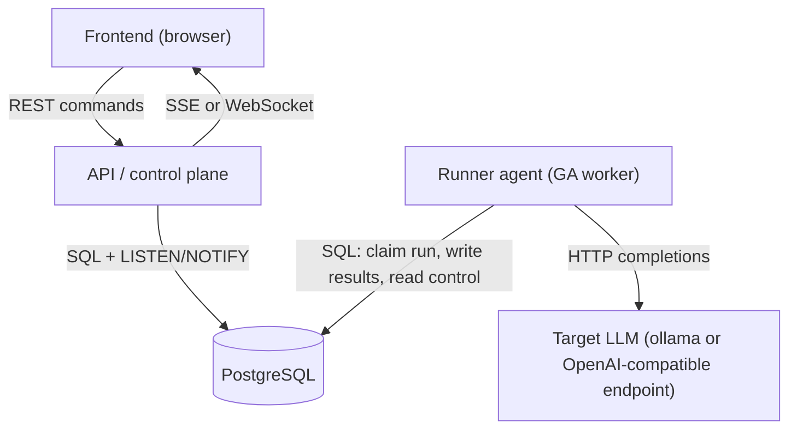
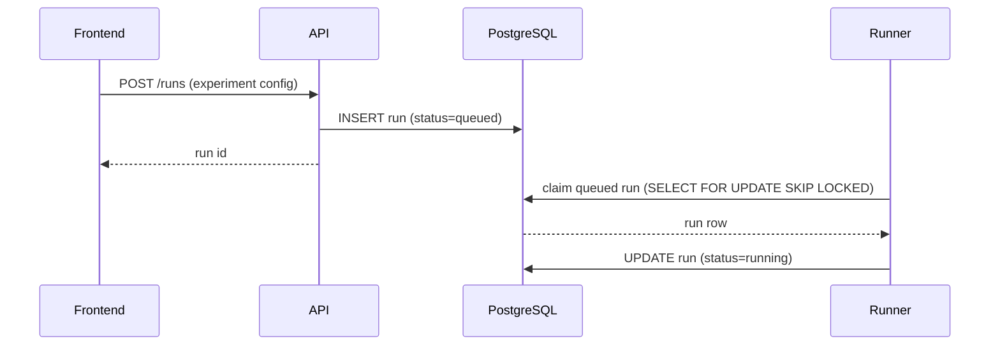
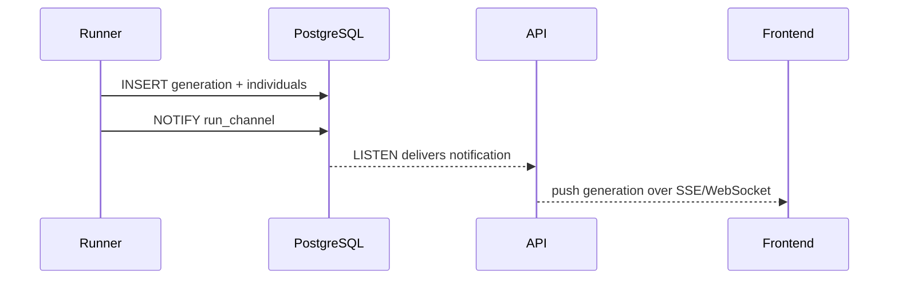
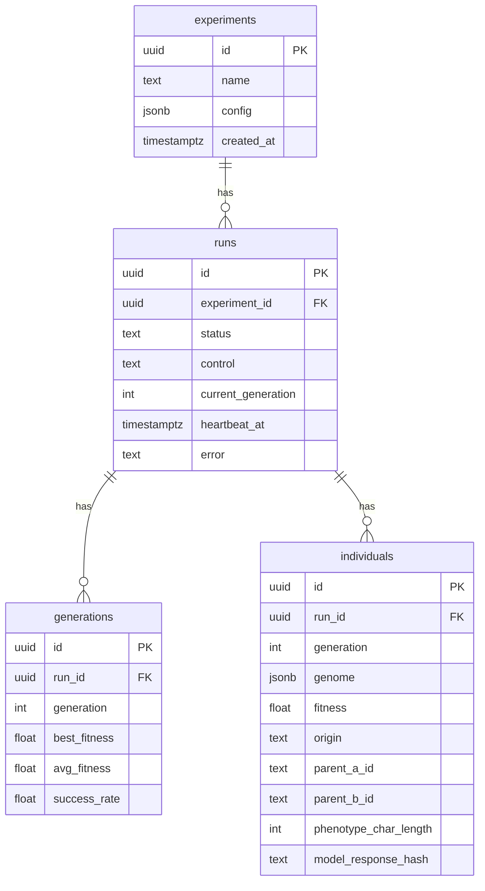
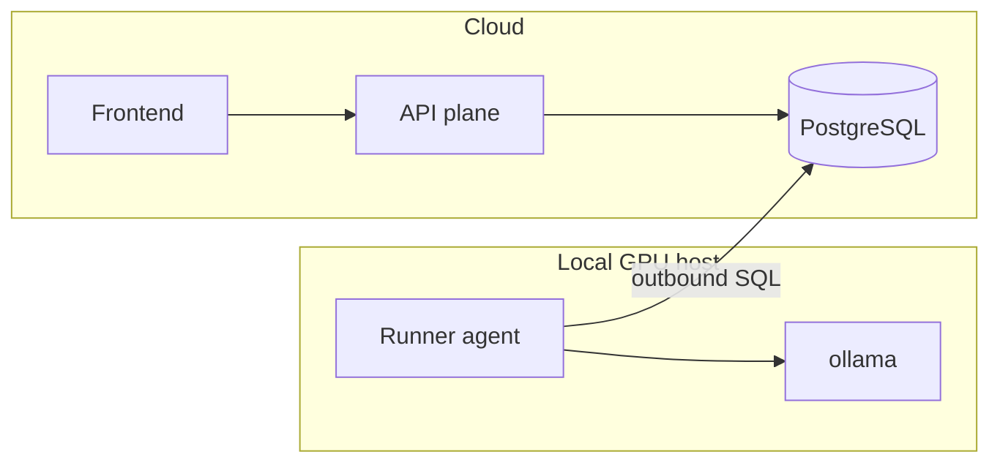
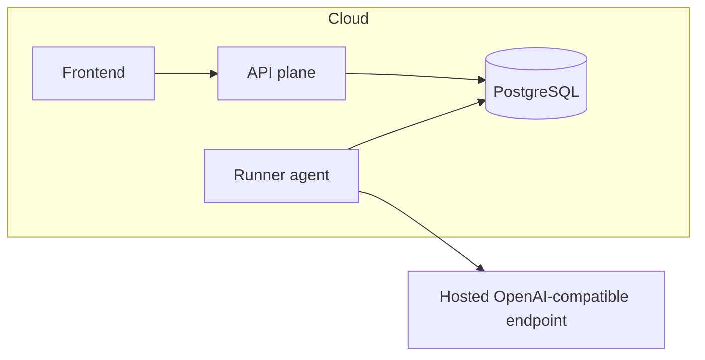

# Deployment Architecture

This document describes how the GA framework is split into independently
deployable components and how they communicate, so the system can be controlled
live from a web frontend instead of run as a one-shot CLI job.

It is a design proposal. The GA core (`src/ga/`) and the file-based runner
(`scripts/run_ga.py`) exist today; the API, the Postgres storage adapter, the
long-lived runner mode, and the frontend are the work this document scopes.

## Goals

- Run, stop, pause, and configure GA experiments from a frontend — not the CLI.
- Stream results to the frontend live as each generation completes.
- Keep all experiment data in one durable store (PostgreSQL).
- Target either a local `ollama` instance or any OpenAI-compatible endpoint
  (the same harness already supports both via `base_url`).
- Preserve the clean-architecture seam: the GA core stays pure; storage and
  delivery are plugins.

## Components

Four deployable units, plus the external LLM:

| Component   | Responsibility                                                        | State        |
|-------------|-----------------------------------------------------------------------|--------------|
| PostgreSQL  | Single source of truth and the control channel between all parts.     | Stateful     |
| API plane   | Translates frontend actions into DB rows; streams DB changes back out.| Stateless    |
| Runner agent| Claims a run, executes the GA loop, writes results, honors control.   | Restartable  |
| Frontend    | Dashboard: create, start, stop, configure runs; live charts, lineage. | Stateless    |
| Target LLM  | Serves completions. Lives next to the runner. Not built by us.        | External     |

The API plane holds **no GA logic**. The runner holds **no HTTP/UI logic**. They
never call each other directly — they coordinate only through Postgres.

## The database is the control plane

Rather than the frontend or API talking to the runner directly (which would
require the runner to be inbound-reachable and add service discovery),
everything coordinates through Postgres. This keeps the runner free to live
behind a firewall next to a local GPU, needing only an outbound DB connection.

### Starting a run

`SELECT ... FOR UPDATE SKIP LOCKED` lets several runners coexist safely — each
claims a distinct queued run without stepping on the others.

### Stop, pause, configure (cooperative control)

The frontend never kills a process. It sets a flag:

- **Stop**: `UPDATE runs SET control='stop'`. The runner reads the flag at the
  next generation boundary and transitions to `stopped`.
- **Pause / resume**: same mechanism with `control='pause'` then `'none'`.
- **Configure**: config lives in a row. Edits before start are free. A defined
  subset of fields (for example `mutation_rate`) may be hot-applied at the next
  generation boundary; structural fields (population size, seed) require a new
  run.

This is **cooperative cancellation**: the runner polls the control flag between
generations. It requires a small change to the loop in `evolution.py` (see
"Required code changes").

### Live updates to the frontend

The runner writes a generation, then issues `NOTIFY`. The API `LISTEN`s and
pushes the new row to subscribed browsers over SSE or WebSocket. Plain polling
of `GET /runs/:id/generations` is the no-dependency fallback and is fine for a
first version.

## Data model

The schema is the current file outputs (`config.json`, `gen_NNN.jsonl`,
`lineage.jsonl`, `summary.csv`) normalized into tables.

- `runs.status`: `queued | running | paused | stopped | completed | failed`.
- `runs.control`: `none | pause | stop`.
- `runs.heartbeat_at`: updated each generation so a dead runner is detectable.
- `individuals` merges today's `gen_NNN.jsonl` records and `lineage.jsonl`.
- `generations` is today's `summary.csv`.

**Open decision — full response text.** Today only `model_response_hash` and the
phenotype length are stored (`individual.py`). A UI that lets you inspect *why* a
prompt succeeded wants the full phenotype and raw model response. Storing them
costs space and keeps potentially sensitive output in the DB. Recommendation:
add nullable `phenotype` and `model_response` columns, gated by a config flag,
defaulting off for large runs.

## Required code changes

The GA core barely changes. The work is at the seams.

1. **Storage as a plugin.** `src/ga/storage.py` already isolates persistence.
   Introduce a `Storage` port and two adapters: the existing `FileStorage` and a
   new `PostgresStorage`. The runner picks one by config. This matches the
   repo's clean-architecture rules — the core depends on the port, not on a DB.

2. **Controllable loop.** `run_experiment()` in `evolution.py` is a blocking
   `while True` with no exit hooks. Refactor it to, between generations:
   poll the run's `control` flag, write a heartbeat, and emit `NOTIFY`. Stop
   cleanly on `stop`; busy-wait or sleep on `pause`.

3. **Long-lived runner mode.** Today `scripts/run_ga.py` runs one experiment and
   exits. Add a worker mode that loops: claim a queued run, execute it, repeat.
   The one-shot CLI stays for local/dry-run use.

4. **Config from DB.** The runner loads `ExperimentConfig` from the `runs`/
   `experiments` row instead of a JSON file. `ExperimentConfig.from_dict`
   already exists, so this is mostly plumbing.

## Deployment topologies

The LLM needs a model endpoint. With `ollama` that typically means a local GPU,
which a cloud host does not provide. That constraint sets the topology.

### Local ollama (primary)

The runner and `ollama` sit together on a GPU machine. Postgres, API, and the
frontend run in the cloud. The runner needs only an **outbound** connection to
Postgres — it is never inbound-reachable.

### Hosted OpenAI-compatible endpoint (optional)

When pointing at a hosted endpoint, no GPU is needed locally and the runner can
also run in the cloud. Only `harness.base_url` and `harness.model` change — no
code change. Useful for CI or when a local GPU is unavailable.

### Platform

The cloud pieces (Postgres, API, eventual frontend) are plain containers plus a
managed Postgres, so they are not tied to any provider. Railway is the concrete
first target: managed Postgres is one click, and the API and frontend deploy as
standard services. The runner deploys to Railway only in the hosted-endpoint
topology; with local `ollama` it runs on the GPU host via the existing
`docker-compose.yml`.

## Phasing

1. **Postgres adapter** — add `PostgresStorage` behind the storage port; runner
   can write to either files or Postgres. No behavior change otherwise.
2. **Controllable runner** — cooperative stop/pause/heartbeat + worker mode that
   claims queued runs.
3. **API plane** — REST for create/start/stop/configure; SSE or WebSocket for
   live generation streaming via `LISTEN/NOTIFY`.
4. **Frontend** — dashboard consuming the API (separate effort).

Each phase is shippable on its own and leaves the existing CLI working.

## Open decisions

- Store full phenotype and model response text, or keep only the hash? (See data
  model.)
- Live transport: SSE vs WebSocket vs polling for v1. Polling is simplest;
  recommend starting there and adding `LISTEN/NOTIFY` push when needed.
- Which config fields are hot-editable mid-run vs require a new run.
- Multiple concurrent runners: supported by the claim mechanism, but confirm it
  is a v1 requirement before building UI around it.
