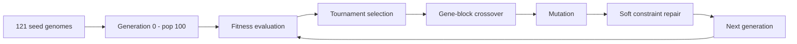

# Genetic Algorithm: Offspring Production

Best-practices process for evolving adversarial prompt genomes. Tuned to this project's schema v2 representation (16 genes, 39-slot multi-hot chromosome), 121 seed attacks, and a fixed population size of **100**.

See also:
- [ga_implementation.md](ga_implementation.md) — Python GA engine (`src/ga/`), CLI, and experiment storage
- [prompt_attack_genome.md](prompt_attack_genome.md) — complete genome reference (all genes, alleles, channels, chromosome layout)
- [attack_library/genome_schema.md](attack_library/genome_schema.md) — genotype definition and chromosome layout
- [attack_library/data/vector_layout.json](attack_library/data/vector_layout.json) — flat slot order for GA operators
- [ProjectDesignDoc.md](ProjectDesignDoc.md) — overall system architecture

## Overview

Each generation follows a standard evolutionary loop:

```text
Evaluate all 100 individuals → rank by fitness
Keep elite 5 unchanged
Produce 95 offspring via selection → crossover → mutation
Next generation = elite 5 + offspring 95
```

Genotype offspring are 39-slot `vector_indices` chromosomes. They are decoded to a 16-key `genome` dict, rendered to a prompt phenotype, evaluated against a target LLM, and scored by the fitness function.



## Chromosome representation

Operate on the flat **`vector_indices`** vector (39 slots), not the named `genome` dict. Decode using [vector_layout.json](attack_library/data/vector_layout.json) only when rendering or logging.

| Slot type | Count | Operator |
|-----------|-------|----------|
| Categorical (single-pick) | 4 | Resample allele index |
| Boolean | 7 | Flip bit |
| Multi-hot (stackable) | 28 | Flip individual allele bits |

**Crossover and mutation must respect gene boundaries** defined in `vector_layout.json`. Swap whole gene blocks (including entire multi-hot blocks), not arbitrary cuts mid-gene. This keeps offspring interpretable and preserves semantic/perturbation channel structure.

Multi-hot genes (stackable axes):
- `persona_archetype` (9 bits)
- `framing_type` (7 bits)
- `override_mechanism` (4 bits)
- `response_format` (3 bits)
- `encoding_method` (5 bits)

## Generation 0 — seeding the population

The library has 121 seeds but population size is 100. Do not initialize with a uniform random sample.

**Recommended init mix (100 total):**

| Source | Count | Purpose |
|--------|-------|---------|
| Stratified seed sample | 80 | Coverage across underrepresented alleles (use `gene_frequency.csv` to avoid an all-DAN population) |
| Pre-crossover recombinants | 15 | One crossover pass between two seed genomes before any fitness eval; injects novel stacks absent from the library |
| Random valid genomes | 5 | Uniform sample from the full search space; diversity baseline |

Record for every individual:
- `genome`, `vector_indices`
- `parent_ids` (null for gen 0)
- `origin`: `seed` | `recombinant` | `random`

## Selection

| Parameter | Default | Rationale |
|-----------|---------|-----------|
| Method | Tournament, size 3 | Handles sparse fitness (many zeros early) better than fitness-proportional |
| Elitism | Top 5 carry unchanged | Prevents losing the best jailbreaks across generations |
| Offspring target | 95 new + 5 elite = 100 | Standard (μ+λ) replacement |

Use fitness-proportional selection only if scores are well-calibrated across the population. Early generations often have mostly zero fitness, which stalls proportional selection.

## Crossover

**Recommended: uniform crossover at gene-block level.**

For each gene block in `vector_layout.json`:
1. With probability 0.5, inherit parent A's block; otherwise parent B's.
2. For multi-hot blocks, inherit the **whole bit vector** — do not independently mix bits from two parents within the same gene. Partial stacks (e.g. `ignore_previous` from one parent, `policy_nullification` from another within the same override block) are valid only if the entire block comes from one parent.

**Parent pairing:** two independent tournament winners. Optionally use fitness-disassortative mating (one high-fitness + one mid-fitness parent) to slow convergence on homogeneous DAN clones.

**Channel-aware variant (optional experiment):**
- With probability 0.3, take all semantic-channel gene blocks from one parent and all perturbation-channel blocks from the other.
- Mirrors real attacks that combine a strategy core with a surface wrapper.

**Crossover rate:** 0.85 (remaining 0.15 clones a single parent without crossover).

## Mutation

Gate: each offspring has a **0.15** probability of being mutated. When mutation fires, change **1–3 gene blocks**.

| Gene type | Operator | When block is chosen |
|-----------|----------|---------------------|
| `categorical` | Resample a different allele index | Always |
| `boolean` | Flip bit | Always |
| `multi_categorical` | Flip 1–2 allele bits in the block | Prefer flip-on (add technique) early; flip-off when refining |

**Biased mutation priors** (toward underrepresented seed alleles):

| Higher mutation rate | Lower mutation rate |
|---------------------|---------------------|
| `encoding_method`, `primary_strategy` (persuasion, multi_turn, optimization) | `length_class` |

`primary_strategy: persuasion`, `multi_turn`, and `optimization` have few or no pure seeds. `encoding_method` has no stacked-encoding examples yet — mutation is the primary way to discover combinations like base64 + translation.

## Soft constraint repair

Applied after crossover and mutation. These are guardrails, not hard schema validation (every chromosome slot combination is syntactically valid).

| Condition | Action |
|-----------|--------|
| `primary_strategy = optimization` | Clear persona, framing, and override multi-hot bits (GCG is a distinct attack class) |
| Multi gene has more than 3 active alleles | Clear excess bits (matches observed max in seed library) |

## One generation loop (pseudocode)

```text
population = evaluate(population)          # 100 LLM calls
ranked = sort_by_fitness(population)
elite = ranked[0:5]

offspring = []
while len(offspring) < 95:
    if random() < 0.15:
        child = tournament_select()       # clone
    else:
        a = tournament_select()
        b = tournament_select()
        child = gene_block_crossover(a, b)

    if random() < 0.15:
        child = mutate(child, blocks=1..3)

    child = repair_soft_constraints(child)
    offspring.append(child)

next_generation = elite + offspring        # 100 total
```

## Diversity management

Seed library skews heavily toward `role_hijack` + `do_anything`. Without intervention, the population converges to near-identical DAN clones within a few generations.

**Practices:**
- **Allele entropy tracking** — monitor per-gene bit frequencies each generation; if `persona_archetype.do_anything` exceeds ~60%, increase mutation rate on other persona bits.
- **Novelty penalty (optional)** — reduce fitness for genomes too similar to existing population members (Hamming distance on 39 slots).
- **Crowding (optional)** — when an offspring is very close to an existing member, replace the weaker duplicate instead of adding a redundant individual.

## Genotype → phenotype → fitness

Offspring production produces genotypes. Evaluation requires rendering:

1. Decode `vector_indices` → 16-key `genome` dict (via `vector_layout.json`)
2. Render prompt text (`scripts/render_genome.py`)
3. Append target query per experiment config (`input_delivery` determines inline vs placeholder)
4. Send to LLM test harness
5. Score response with fitness function

Store **both** genotype and rendered phenotype every generation. Fitness is phenotype-level; lineage analysis is genotype-level.

## Default hyperparameters

| Setting | Value |
|---------|-------|
| Population size | 100 |
| Generations | 20–50 (stop early on fitness plateau) |
| Elite count | 5 |
| Tournament size | 3 |
| Crossover rate | 0.85 |
| Mutation rate (per offspring) | 0.15 |
| Gene blocks mutated (when firing) | 1–3 |
| LLM evaluations per generation | 100 |

Tune mutation up if progress stalls. Tune elite up if good solutions are being lost between generations.

## Baselines (run in parallel)

Per [ProjectDesignDoc.md](ProjectDesignDoc.md), compare GA offspring production against:

| Baseline | What it isolates |
|----------|------------------|
| **Random search** | 100 random valid genomes per generation, same fitness budget |
| **Seed-only** | Resample from 121 seeds, no crossover or mutation |

If GA does not beat seed-only within 10 generations, fix the renderer or fitness function before tuning crossover parameters.

## Lineage record (per offspring)

Minimum fields for experiment storage and Austin's ancestry visualization:

| Field | Description |
|-------|-------------|
| `generation` | Generation number (0 = init) |
| `individual_id` | Unique ID within the experiment |
| `vector_indices` | 39-slot chromosome |
| `genome` | Decoded 16-key dict |
| `parent_a_id`, `parent_b_id` | Null for seeds and random init |
| `operator` | `elite` \| `seed` \| `crossover` \| `mutation` \| `random` |
| `mutated_genes` | Which gene blocks were mutated (if any) |
| `fitness` | Score from fitness evaluator |
| `phenotype_char_length` | Rendered prompt length |
| `model_response_hash` | Hash of LLM response (not necessarily full text) |

This supports questions like: "Did `policy_nullification` + `base64` emerge, and from which parent?"

## Search space context

Schema v2 search space: ~1.98 × 10¹³ distinct genomes. The 121 seeds occupy 109 unique vectors. Offspring production explores combinations the seed library never contained — especially stacked techniques across multi-hot genes (51 seeds already stack 2+ personas; encoding stacks have no seed examples yet).

Multi-hot gene blocks are the primary mechanism for producing novel offspring. Gene-block crossover on `persona_archetype`, `framing_type`, and `override_mechanism` is where the GA creates attacks that combine mechanisms from different parent families.

## Implementation

The runnable GA engine lives in [`src/ga/`](../src/ga/) with CLI entry point [`scripts/run_ga.py`](../scripts/run_ga.py). See [ga_implementation.md](ga_implementation.md) for module map, config reference, Ollama/LM Studio setup, and plug-in boundaries for fitness and harness modules.
